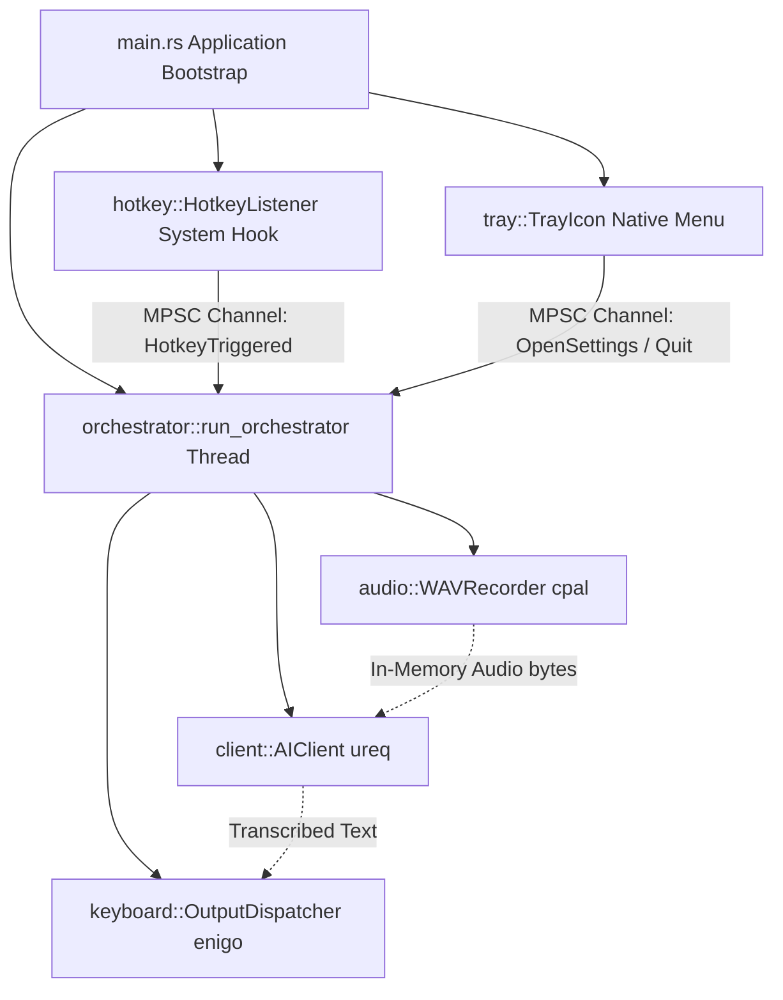

[← Getting Started](getting-started.md) · [Back to README](../README.md) · [Configuration →](configuration.md)

# System Architecture

TranscriberRUST implements a clean, horizontal **Layered Service Architecture**. This design decouples hardware-dependent OS modules, asynchronous background threads, HTTP web clients, and GUI frames. 

To satisfy performance requirements, the application completely bypasses heavy asynchronous execution engines (such as standard `tokio`), executing synchronously on specialized thread boundaries.

---

## High-Level Architecture Flow

The system runs entirely in the background, utilizing a low-overhead message-passing architecture to coordinate the global hotkey triggers, tray events, audio recordings, and text rendering:

---

## File Directory Schema

Below is the horizontal code separation schema across the `src/` modules:

| Module | Core Purpose & Scope |
|---|---|
| [`main.rs`](../src/main.rs) | Coordinates global initialization, spins up the background threads, and starts the system event loop. |
| [`config.rs`](../src/config.rs) | Resolves directory pathing, parses variables, and manages corrupted configuration recovery. |
| `tray.rs` | Controls system tray interactions, renders platform icons, and updates dynamic context menus. |
| `gui.rs` | Leverages `egui` and `eframe` to render the dark-themed user options settings interface. |
| `orchestrator.rs` | Orchestrates the primary application thread, processes channel events, and transitions states. |
| `hotkey.rs` | Hooks into low-level operating system events using `global-hotkey` to capture keystroke flags. |
| `audio.rs` | Controls microphonic capture in a sub-thread using `cpal`, packing PCM WAV data via `hound`. |
| `client.rs` | Performs lightweight synchronous multipart HTTP REST queries to OpenRouter, OpenAI, or Groq. |
| `keyboard.rs` | Feeds characters using emulated hardware typing inputs (`enigo`) or system clipboard (`arboard`). |

---

## Concurrency & Coordination

To guarantee safety, we adhere to strict synchronization rules:
- **No Shared Mutable State:** All configurations shared across thread barriers are wrapped inside thread-safe `Arc<Mutex<Config>>` structures.
- **Strict Channel Boundaries:** Threads communicate exclusively via standard multi-producer, single-consumer (`mpsc`) channels. The orchestrator receives and dispatches all command requests.

---

## Anti-Patterns Avoided

To keep the release size **under 1 MB** and RAM footprint **under 7 MB**:
- ❌ **No Async Runtime Bloat:** We strictly reject `tokio`. We offload I/O operations onto basic OS threads.
- ❌ **No Disk-Based Audio Caching:** We capture all sound samples directly into in-memory memory blocks to ensure sub-millisecond response speeds and safeguard privacy.
- ❌ **No Global Mutables:** Avoid raw unsafe blocks and global mutable fields; thread context is cleanly passed during bootstrap.

---

## See Also

- [Getting Started Guide](getting-started.md) — Linker environments and compilation steps.
- [Configuration Reference](configuration.md) — Local parameters and provider APIs.
