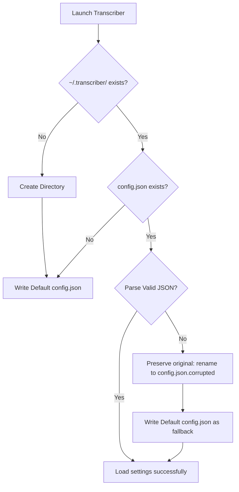

[← Architecture](architecture.md) · [Back to README](../README.md)

# Configuration Reference

TranscriberRUST manages all credentials, hotkey combinations, and custom transcription/translation system prompts locally in a single JSON file.

---

## File Path & Environment Redirection

By default, the application resolves the config file in a platform-agnostic directory under the user's home directory:
```text
C:\Users\<YourUsername>\.transcriber\config.json
```

### Environmental Redirection
During automated testing, unit tests isolate disk interactions by overriding home directories via `USERPROFILE` or `HOME` environment variables, ensuring that standard user preferences are never overwritten.

---

## Schema Reference

The configuration file contains the following JSON structure:

| Parameter Key | Description | Data Type | Default Value |
|---|---|---|---|
| `provider` | The active AI provider. Supported choices: `openrouter`, `openai`, `groq`. | String | `"openrouter"` |
| `openrouter_api_key` | Secret API key for OpenRouter connections. | String | `""` |
| `openrouter_model` | Active LLM for audio transcription via OpenRouter. | String | `"google/gemini-3.1-flash-lite"` |
| `openai_api_key` | Secret API key for OpenAI Whisper. | String | `""` |
| `openai_model` | Active transcription model identifier for OpenAI. | String | `"whisper-1"` |
| `openai_chat_model` | Accompanying chat model for secondary text cleaning. | String | `"gpt-4o-mini"` |
| `groq_api_key` | Secret API key for Groq Cloud. | String | `""` |
| `groq_model` | Rapid Whisper model identifier for Groq. | String | `"whisper-large-v3"` |
| `groq_chat_model` | Chat model for structural parsing on Groq. | String | `"llama3-8b-8192"` |
| `hotkey` | System-wide trigger combination. | String | `"ctrl+shift+space"` |
| `insert_mode` | Text delivery style. Options: `typewriter` or `clipboard`. | String | `"typewriter"` |
| `transcription_mode` | Active parsing style. Options: `clean` or `translate`. | String | `"clean"` |
| `audio_duration_limit` | Absolute maximum recording buffer threshold (in seconds). | u32 | `30` |
| `system_prompt` | System rules and instructions passed to the transcription backends. | String | *See below* |

### Default System Prompt
The default system instructions configured out-of-the-box are carefully tuned to eliminate stutters and prevent hallucinations:
```text
You are a pure audio transcription tool. Your ONLY task is to transcribe exactly what is spoken in the audio. Do NOT generate new text, do NOT hallucinate, do NOT complete sentences, and do NOT add any extra information. If you hear nothing or only noise, return an empty string. The audio may contain speech in Russian, English, or Uzbek. Return ONLY the transcribed text in its original language, exactly as spoken. No explanations, no translations, no prefixes.
```

---

## Corruption Recovery Protocol

To ensure reliability, the `Config::load()` initialization engine executes a multi-stage safety routine to protect your preferences from file corruption or partial writes:



If a corruption event is triggered:
1. The corrupted configuration is automatically backed up as `config.json.corrupted` so your keys and presets are never lost.
2. A clean, default `config.json` is generated so the application launches instantly without crashing.
3. Verbose warning levels are logged to `env_logger`.

---

## See Also

- [Getting Started Guide](getting-started.md) — Shell command setups and compilation tools.
- [System Architecture](architecture.md) — Background queues and data structures.
